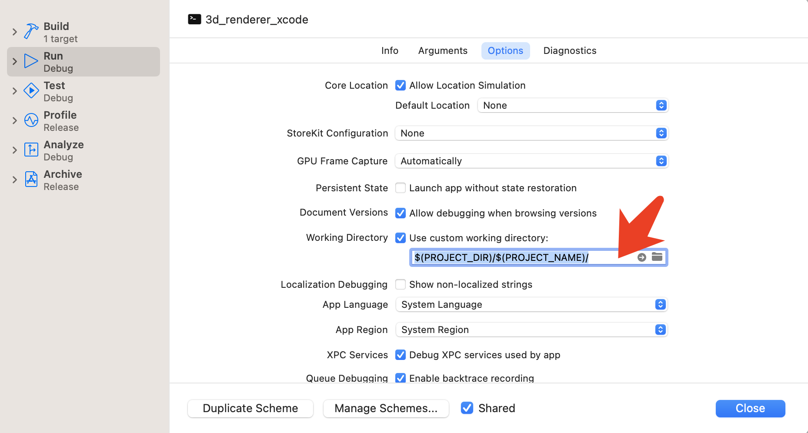

# 3D Graphics Programming from scratch

This is my learning process of Pikuma's [3D Graphics From Scratch](https://pikuma.com/courses/learn-3d-computer-graphics-programming) course.  ($69.99)

Using only **SDL2** and a **C compiler**. **No** Graphics API, **no** GPU, **no** OpenGL, **no** Metal, **no** DirectX!

Implement a **software-renderer** from scratch, **draw** every pixel on the screen to render a **3D** obj model file.

## How to build & run

Xcode press **Run** button

Development environment: using [Xcode](https://developer.apple.com/xcode/).

["Setting up SDL 2 on XCode 13.4.1"](https://lazyfoo.net/tutorials/SDL/01_hello_SDL/mac/xcode/index.php)

## SDL 2 and Xcode trouble shootings: 
### I cannot build and run, dyld cannot find suitable dynamic library at runtime

- Third-Party framework need to be **code signed** before running, a strict restriction enforced by Xcode and macOS recently.

- Project settings -> General -> Frameworks and Libraries, SDL2.framework, change 'Embed' from 'Do Not Embed' to 'Embed and Sign'

### Why there are no autocomplete or Intellisence, and "cannot find SDL2.h" error? 
- you have to **clean** after every build, see ["Weird Problem with XCode, SDL2, and Catalina"](https://discourse.libsdl.org/t/weird-problem-with-xcode-sdl2-and-catalina/27411/1)

- Press **cmd+option+k** to clean the project, after every cmd+r

### How to set working directory, so program can access the assets folder to fetch images or 3D obj files? 

